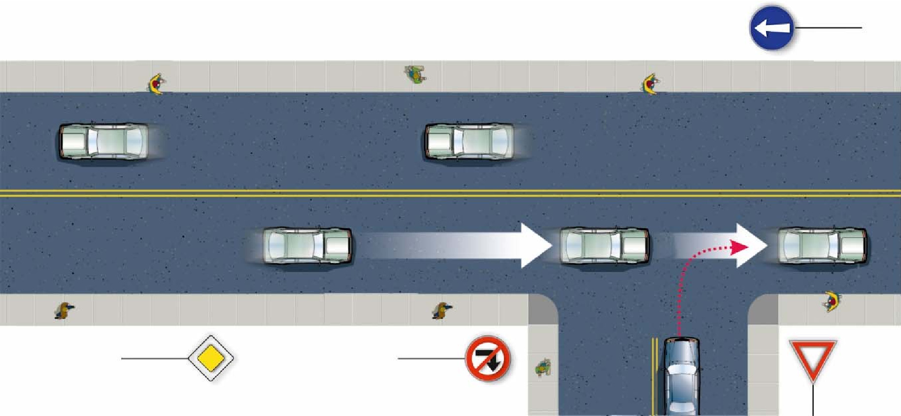
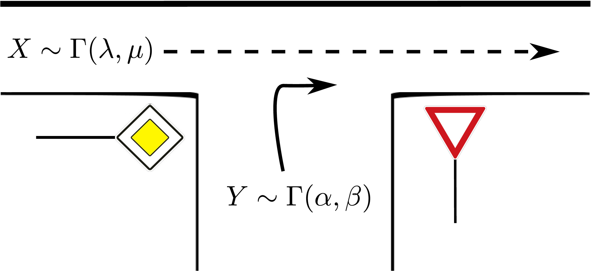
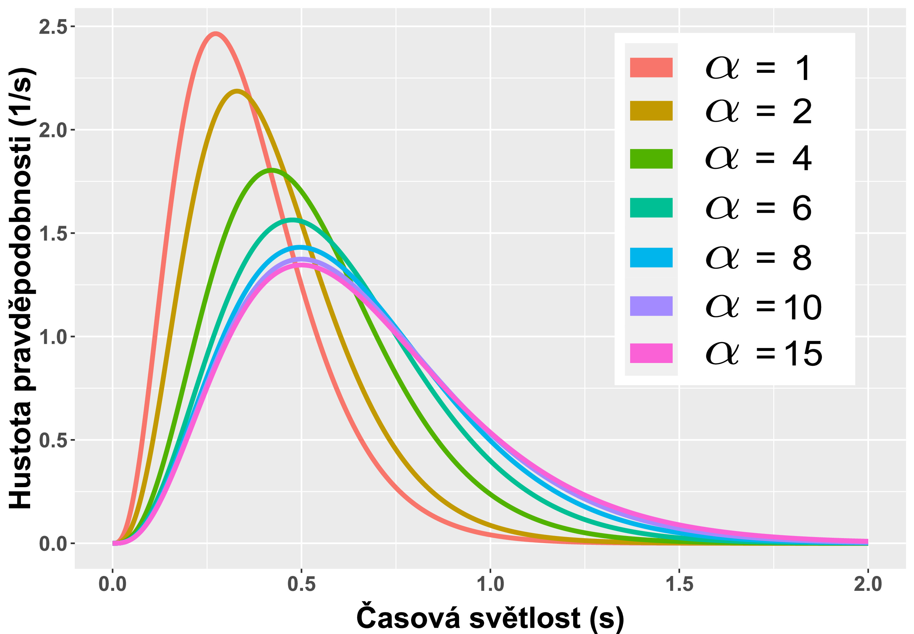
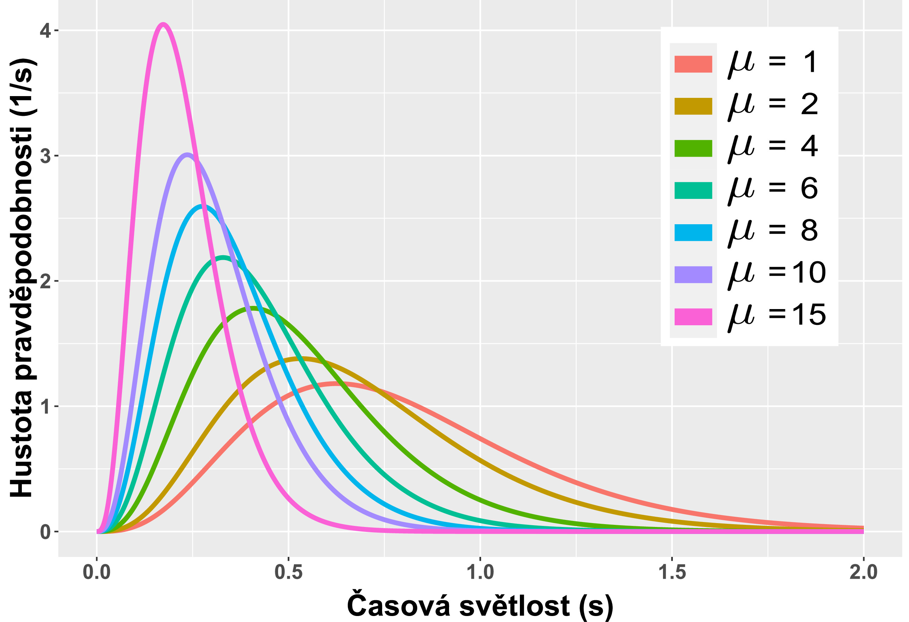
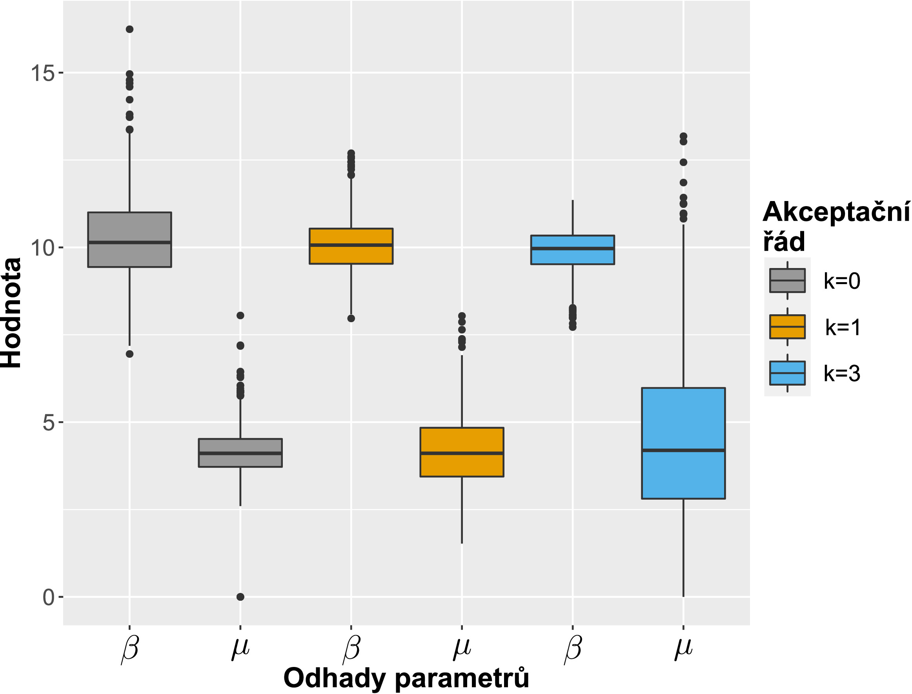
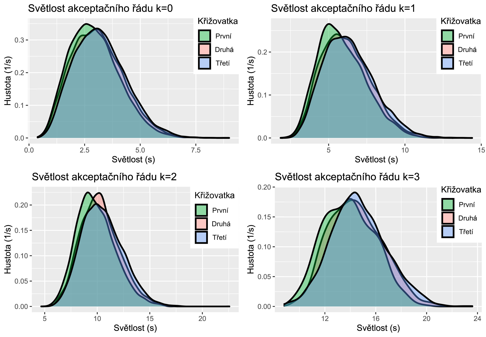

# Gap Acceptance Research

This paper deals with statistical modelling of critical clearances which are the main subject
of the __Gap Acceptance theory__. 

First, we used appropriate terminology to define a mathematical model
of an unsignalized T intersection. Using this model we presented the problem of the partial distribution
of clearances of order $k \in \mathbb{N}_0$. 

Assuming gamma distribution of clearances and critical clearances we
derived a solution to this problem. We later validated this solution by using numerical computations. Further, with the premise of gamma distributed critical clearances, we analytically derived the Siegloch
function. 

At last, we verified that the empirical partial distribution of clearances of order $k \in \{0, 1, 2, 3\}$
(recorded at three German T intersections) belongs to the family of previously derived partial distribution
of clearances. This hypothesis was evaluated by using Pearson’s $\chi$-squared goodness of fit test.

The full report is available here: [Full report](report.pdf).

    
    

## Features

- Mathematical model of unsignalized T-intersection
- Analytical derivation of partial distributions of order $k$ and Siegloch function

    
    

- Real traffic data analysis

    
    

